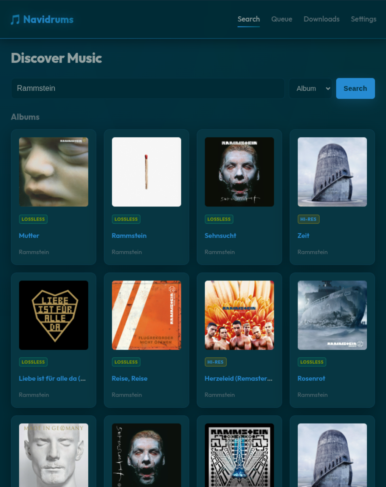
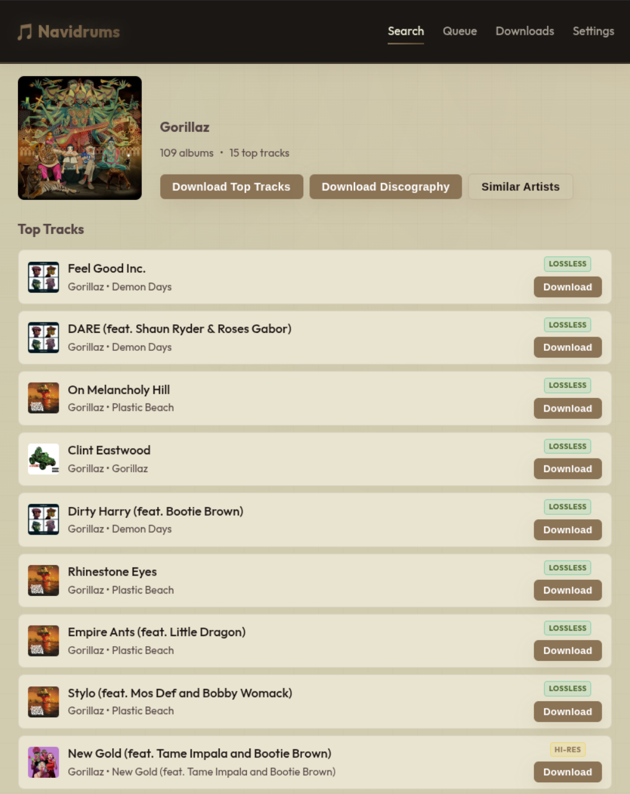
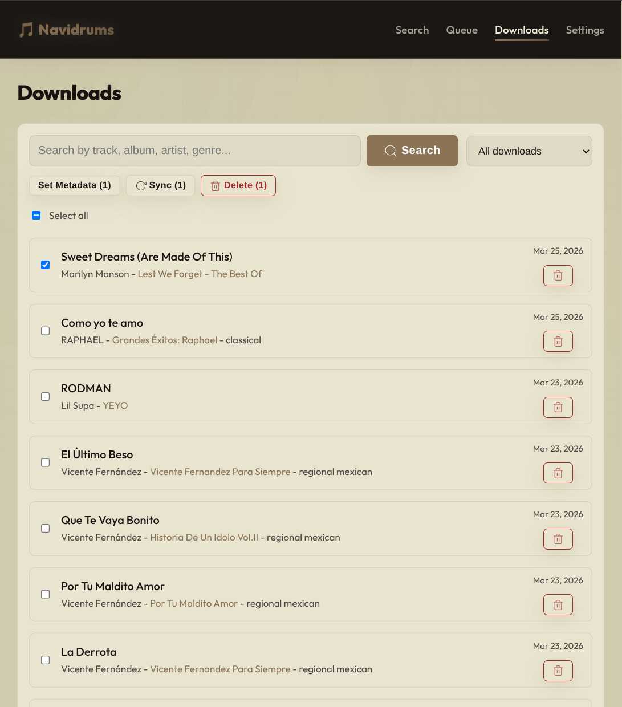
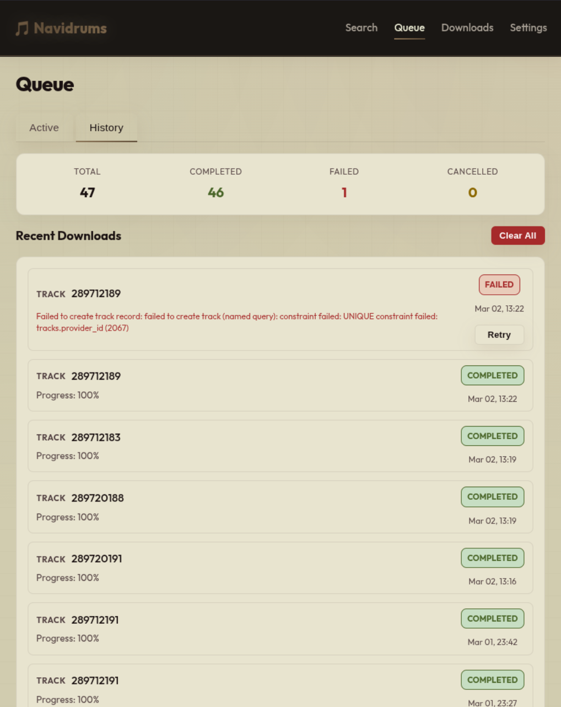
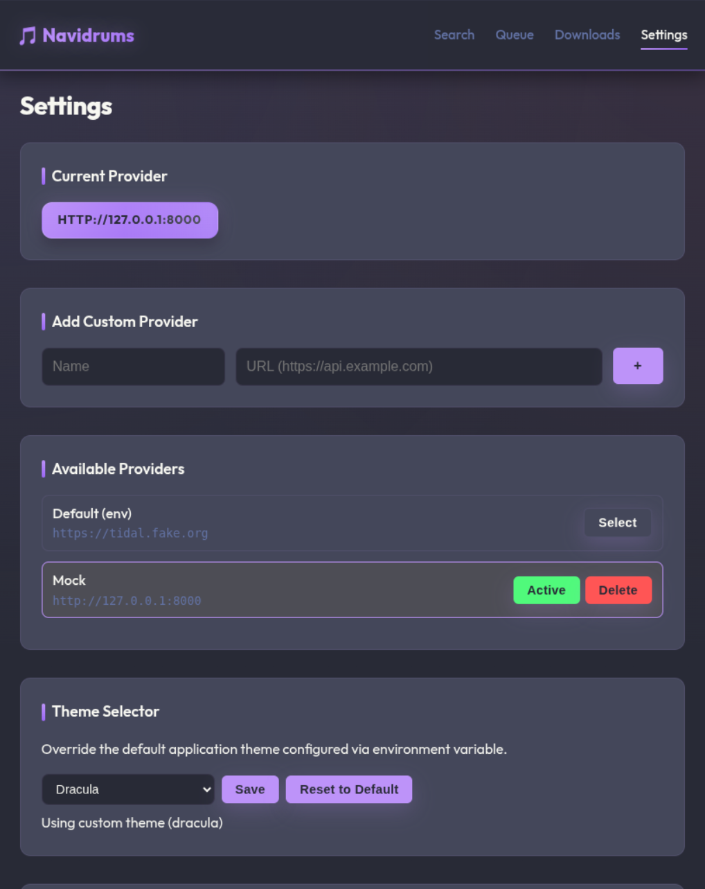
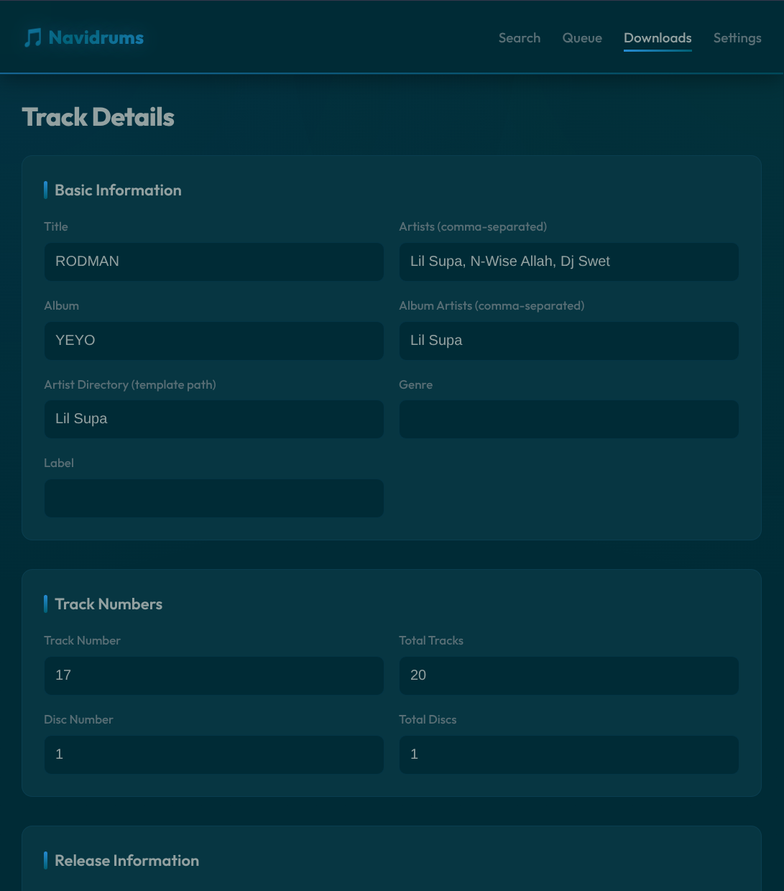
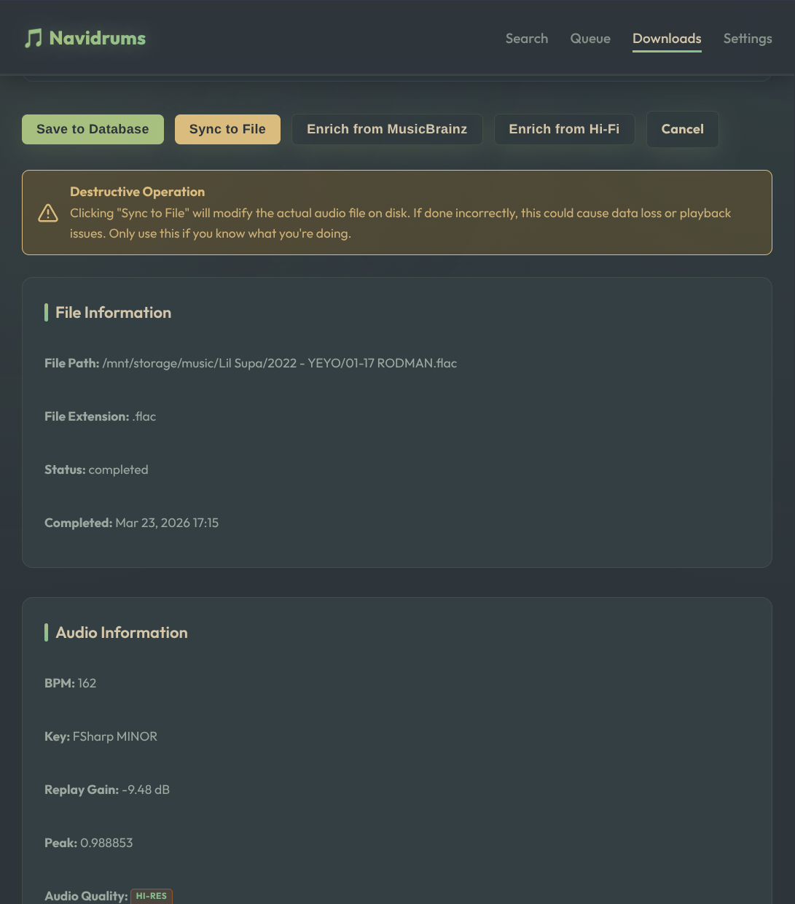

# Navidrums

A lightweight self-hosted web application for browsing and downloading music to your Navidrome library.
Optimized for low-end hardware.

## Features

### Core Functionality
- **Browse & Search**: Discover artists, albums, playlists, and tracks from remote Hifi API
- **Download Queue**: Asynchronous job queuing with configurable concurrency control
- **Provider Management**: Switch between multiple Hifi API endpoints and add custom providers
- **Quality Selection**: Choose from LOSSLESS, HI_RES_LOSSLESS, HIGH, or LOW audio quality

### Download Management
- **Queue Page**: Monitor active downloads with real-time progress updates
- **Downloads Browser**: Browse, search (by track, album, artist, genre), filter (by genre including "no_genre"), and manage downloaded tracks with bulk actions (delete, sync, set metadata)
- **Bulk Metadata**: Set genre, year, mood, and style for multiple tracks at once
- **Sync to File**: Re-tag audio files with updated metadata from Database
- **Sync All**: Fetch missing metadata from Hifi API and MusicBrainz, update Database and sync to files
- **History Tracking**: View last 20 completed/failed/cancelled downloads
- **Job Management**: Cancel active jobs, retry failed downloads, clear history
- **Stuck Job Recovery**: Automatic reset of interrupted downloads on startup

### Metadata & Tagging
- **Comprehensive Tagging**: Automatically embeds metadata in audio files:
  - **Basic**: Title, Artist(s), Album Artist(s), Album, Track/Disc Numbers
  - **Release Details**: Year, Release Date, Genre, Label, ISRC, Copyright, Composer
  - **Extended**: BPM, Key, KeyScale, ReplayGain, Peak levels, MusicBrainz IDs
  - **Mood/Style**: Custom mood and style tags for personal organization (manual addition by track or bulk action)
  - **Commercial**: Barcode, Catalog Number, Release Type
  - **Lyrics**: Unsynchronized lyrics (LYRICS) and subtitles (LRC format)
- **Album Art Handling**: Embedded cover art + saved as `cover.jpg` in album folders
- **Playlist Images**: Cover images saved to playlists folder
- **MusicBrainz Integration**: Metadata enrichment using ISRC codes and genre fetching

### File Management
- **Format Support**: FLAC and MP3 audio formats (MP4/M4A support stubbed)
- **File Verification**: SHA256 hash checking with `LastVerifiedAt` tracking
- **Path Organization**: Configurable directory structure via Go templates
- **Path Sanitization**: Automatic cleaning of invalid filesystem characters
- **Empty Directory Cleanup**: Automatic removal of empty folders after deletions
- **Playlist Generation**: Automatic M3U file creation for playlists and artist top tracks

### Performance & Reliability
- **Caching System**: Provider response caching with configurable TTL
- **API Throttling**: Built-in request throttling for external APIs (HiFi, MusicBrainz) to prevent rate limiting
- **Automatic Retries**: Exponential backoff with 3 attempts for failed downloads
- **Concurrent Downloads**: Configurable worker concurrency (default: 2)
- **File Hash Verification**: Prevents duplicate downloads via hash matching
- **Statistics Tracking**: Job success/failure rates and performance metrics

### User Interface
- **HTMX-Powered**: Responsive UI with no JSON APIs for frontend
- **Real-time Updates**: Live progress updates without page reloads
- **Component-based**: Modular templates for maintainable UI code
- **Basic Authentication**: Optional HTTP basic auth protection
- **Track Details View**: Comprehensive file, audio, and MusicBrainz metadata display

### Settings
- **Provider Management**: Add, switch, and remove custom Hifi API providers
- **Genre Mapping**: Customize how MusicBrainz genres are normalized (maps sub-genres to main genres)
- **Genre Separator**: Configure the separator used when writing multiple genres to audio tags

### Security

**Recommended: Use Cloudflare Tunnel or Zero Trust instead of basic auth**

For production deployments exposed to the internet, we strongly recommend using a reverse proxy with built-in authentication instead of HTTP basic auth:

- **Cloudflare Tunnel (Zero Trust)**: Tunnel your service through Cloudflare withAccess policies, SSO integration, and built-in DDoS protection
- **Traefik**: Configure OAuth2 or ForwardAuth middleware
- **Nginx**: Use Auth_request module with external auth service
- **Caddy**: Built-in OAuth2 or Cloudflare API key support

Basic auth has limitations:
- Credentials sent with every request (even if over HTTPS)
- No MFA/SSO support
- Hard to revoke without changing passwords

When using a proxy with authentication, set `SKIP_AUTH=true` to disable built-in auth:
```bash
SKIP_AUTH=true ./navidrums
```

Rate limiting is still applied as a second layer of protection.

### Data Architecture
- **Two-Table Design**: Jobs (work queue) + Tracks (full metadata) separation
- **SQLite Database**: Efficient embedded database with WAL mode for concurrency
- **Data Invariants**: Prevents duplicate downloads, ensures file-tagging order

## Prerequisites

- **Docker & Docker Compose** (for Docker installation only)
- **Go 1.22+** (for building from source)
- **Hifi API** running (default: `http://127.0.0.1:8000`)

## Configuration

Environment variables:

| Variable | Default | Description |
|---|---|---|
| `PORT` | `8080` | HTTP server port |
| `DB_PATH` | `navidrums.db` | SQLite database file path |
| `DOWNLOADS_DIR` | `~/Downloads/navidrums` | Output directory for downloaded music |
| `SUBDIR_TEMPLATE` | `{{.AlbumArtist}}/{{.OriginalYear}} - {{.Album}}/{{.Disc}}-{{.Track}} {{.Title}}` | Go template for file organization |
| `PROVIDER_URL` | `http://127.0.0.1:8000` | URL of the Hifi API provider |
| `QUALITY` | `LOSSLESS` | Audio quality (`LOSSLESS`, `HI_RES_LOSSLESS`, `HIGH`, `LOW`) |
| `LOG_LEVEL` | `info` | Logging level (`debug`, `info`, `warn`, `error`) |
| `LOG_FORMAT` | `text` | Log output format (`text`, `json`) |
| `NAVIDRUMS_USERNAME` | `navidrums` | Username for HTTP basic authentication |
| `NAVIDRUMS_PASSWORD` | (empty) | Password for HTTP basic authentication (empty disables auth) |
| `SKIP_AUTH` | `false` | Set to `true` to disable authentication entirely |
| `CACHE_TTL` | `12h` | Provider response cache TTL (e.g., `1h`, `24h`, `7d`) |
| `MUSICBRAINZ_URL` | `https://musicbrainz.org/ws/2` | MusicBrainz API endpoint for metadata enrichment |
| `RATE_LIMIT_REQUESTS` | `200` | Maximum requests per rate limit window |
| `RATE_LIMIT_WINDOW` | `1m` | Rate limit time window (e.g., `30s`, `1m`) |
| `RATE_LIMIT_BURST` | `10` | Burst requests allowed beyond the rate limit |

**Template Variables:**

The `SUBDIR_TEMPLATE` uses Go's `text/template` syntax. Available variables:
- `{{.AlbumArtist}}` - Album artist (falls back to track artist if empty)
- `{{.OriginalYear}}` - Release year (integer)
- `{{.Album}}` - Album name
- `{{.Disc}}` - Disc number, zero-padded (01, 02, etc.)
- `{{.Track}}` - Track number, zero-padded (01, 02, etc.)
- `{{.Title}}` - Track title

The file extension (`.flac`, `.mp3`, or `.mp4`) is appended automatically.

**Example:** The default template produces paths like:
```
~/Downloads/navidrums/Pink Floyd/1973 - The Dark Side of the Moon/01-01 Speak to Me.flac
```

**Note:** Invalid filesystem characters (`<>:"/\|?*`) are automatically sanitized from paths.

HiFi API: https://github.com/binimum/hifi-api

## Installation

### Option 1: Download Pre-built Binary (Recommended)

1. Download the latest release for your platform from the [Releases page](https://github.com/cesargomez89/navidrums/releases):
   - **Linux (x86_64)**: `navidrums-linux-amd64`
   - **Linux (ARM64/Raspberry Pi)**: `navidrums-linux-arm64`
   - **macOS (Intel)**: `navidrums-darwin-amd64`
   - **macOS (Apple Silicon)**: `navidrums-darwin-arm64`
   - **Windows (x86_64)**: `navidrums-windows-amd64.exe`

2. Make the binary executable (Linux/macOS):
   ```bash
   chmod +x navidrums-*
   ```

3. Optionally, move it to a directory in your PATH:
   ```bash
   sudo mv navidrums-* /usr/local/bin/navidrums

   ```

### Self-Hosted Server Setup

#### Running as a Systemd Service (Linux)

1. Create a systemd service file at `/etc/systemd/system/navidrums.service`:

   ```ini
   [Unit]
   Description=Navidrums Music Downloader
   After=network.target

   [Service]
   Type=simple
   User=YOUR_USERNAME
   WorkingDirectory=/home/YOUR_USERNAME/navidrums
   Environment="PORT=8080"
   Environment="DB_PATH=/home/YOUR_USERNAME/navidrums/navidrums.db"
   Environment="DOWNLOADS_DIR=/home/YOUR_USERNAME/Music"
   Environment="PROVIDER_URL=http://127.0.0.1:8000"
   Environment="QUALITY=LOSSLESS"
   Environment="NAVIDRUMS_USERNAME=navidrums"
   Environment="NAVIDRUMS_PASSWORD=password"
   ExecStart=/usr/local/bin/navidrums
   Restart=always
   RestartSec=10

   [Install]
   WantedBy=multi-user.target
   ```

2. Replace `YOUR_USERNAME` with your actual username and adjust paths as needed.

3. Enable and start the service:
   ```bash
   sudo systemctl daemon-reload
   sudo systemctl enable navidrums
   sudo systemctl start navidrums
   ```

4. Check service status:
   ```bash
   sudo systemctl status navidrums
   ```


**Note:** The binary is self-contained with all templates and assets embedded. You only need the single executable file to run the application.

## Build from Source / Development Setup

1. Clone the repository.
2. Build the server:
   ```bash
   go build -o navidrums ./cmd/server
   ```

### Usage

1. Start the server:
   ```bash
   NAVIDRUMS_PASSWORD=admin PROVIDER_URL=https://your-hifi-url.com ./navidrums
   ```
2. Open browser at `http://localhost:8080`.
3. Search for music and click download.
4. Check the "Queue" tab for progress.

## Docker

### Option 1: Docker Compose

1. Clone the repository:
   ```bash
   git clone https://github.com/cesargomez89/navidrums.git
   cd navidrums
   ```

2. Create `.env` file:
   ```bash
   cp .env.sample .env
   ```
   Edit `.env` and set at least:
   ```
   PROVIDER_URL=https://your-hifi-api.com
   NAVIDRUMS_PASSWORD=your-secure-password
   ```

3. Start the container:
   ```bash
   docker-compose up -d
   ```

4. Open browser at `http://localhost:8080`.

**Note:** Downloads are saved to `./downloads` and database to `./navidrums.db` in the project directory.

### Option 2: Docker Run (Without Compose)

1. Create a directory for downloads and database:
   ```bash
   mkdir -p ~/navidrums/downloads
   ```

2. Run the container:
   ```bash
   docker run -d \
     --name navidrums \
     -p 8080:8080 \
     -v ~/navidrums/downloads:/downloads \
     -v ~/navidrums/navidrums.db:/app/navidrums.db \
     -e PROVIDER_URL=https://your-hifi-api.com \
     -e NAVIDRUMS_PASSWORD=your-secure-password \
     --restart unless-stopped \
     ghcr.io/cesargomez89/navidrums:latest
   ```

3. Open browser at `http://localhost:8080`.

### Environment Variables

See the [Configuration](#configuration) section for all available options. The most important ones:

| Variable | Description |
|----------|-------------|
| `PROVIDER_URL` | Your Hifi API URL (required) |
| `NAVIDRUMS_PASSWORD` | Web interface password (empty disables auth) |
| `DOWNLOADS_DIR` | Container path `/downloads` (mounted volume) |
| `DB_PATH` | Container path `/app/navidrums.db` (mounted volume) |
| `SUBDIR_TEMPLATE` | File organization template (optional) |
| `QUALITY` | Audio quality preference (optional) |

### Customizing Paths

To use different host directories, modify the volume mounts:

**Docker Compose:** Edit `docker-compose.yml`:
```yaml
volumes:
  - /custom/path/to/music:/downloads
  - /custom/path/to/database.db:/app/navidrums.db
```

**Docker Run:** Change the `-v` arguments:
```bash
-v /custom/path/to/music:/downloads \
-v /custom/path/to/database.db:/app/navidrums.db
```

## Screenshots

<p align="center">
  
</p>

<p align="center">
  
  
</p>

<p align="center">
  
  
</p>

<p align="center">
  
  
</p>

## Development

Run tests:
```bash
go test ./...
```

## Creating a Release

To create a new release:

1. Tag the commit:
   ```bash
   git tag v1.0.0
   git push origin v1.0.0
   ```

2. GitHub Actions will automatically build binaries for all platforms and create a release.

## Architecture

Navidrums follows a clean layered architecture with clear separation of concerns:

### Data Architecture
- **Two-Table Design**: Jobs (minimal work queue) + Tracks (full metadata and download state)
- **Job Lifecycle**: `queued → running → completed | failed | cancelled`
- **Track Lifecycle**: `missing → queued → downloading → downloaded → processing → completed | failed`
- **Duplicate Prevention**: Unique `provider_id` constraint prevents duplicate downloads

### Layer Separation
- **HTTP Handlers**: Request parsing and HTML rendering only
- **Application Services**: Business logic and workflow orchestration  
- **Repository**: Database persistence and queries
- **Providers**: External API adapters and catalog interface
- **Storage**: Filesystem operations and path management
- **Workers**: Background job processing with concurrency control

### Key Design Principles
- No downloads in HTTP handlers
- No goroutines in HTTP handlers  
- No database access outside store package
- No file writes outside storage package
- All heavy operations run asynchronously via background workers

See [ARCHITECTURE.md](ARCHITECTURE.md) for technical architecture details and [DOMAIN.md](DOMAIN.md) for domain model specifications.

